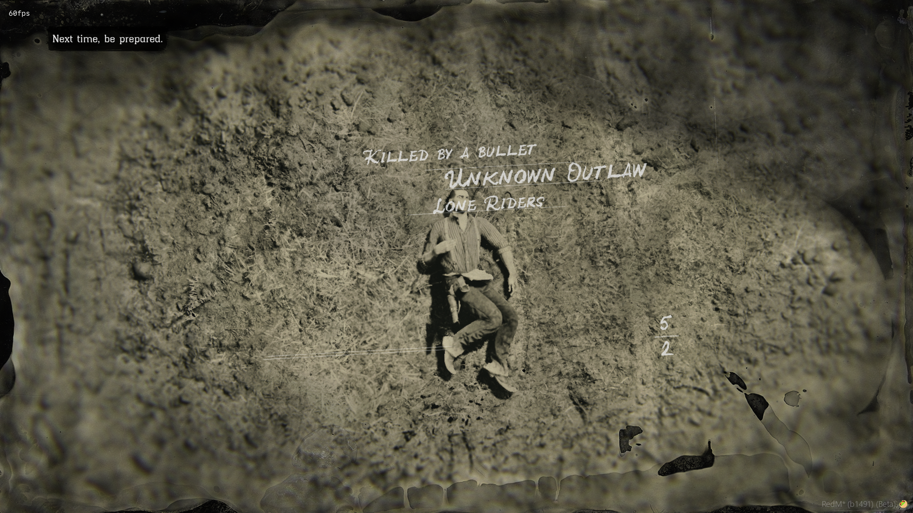

```lua
RegisterCommand("deathscreen", function()
    SetEntityHealth(PlayerPedId(), 0)
    CreateKillCam(PlayerPedId())
    Wait(1400)
    local uiFlowblock = UiflowblockRequest(209170685)

    local temp = 0
    while not UiflowblockIsLoaded(uiFlowblock) do 
        temp = temp + 1
        if temp > 10000 then 
            print('Failed To Load Flowblock')
            return 
        end
        Citizen.Wait(1) 
    end


    while not UiflowblockIsLoaded(uiFlowblock) do
        Wait(200)
    end

    local container =  DatabindingAddDataContainerFromPath("", "mpDeathScreen")

    DatabindingAddDataBool(container, "showScreen", true)
    DatabindingAddDataString(container, "labelAction", "Killed by a bullet") 
    DatabindingAddDataString(container, "labelOpponent", "Unknown Outlaw")
    DatabindingAddDataString(container, "labelPosse", "Lone Riders")
    DatabindingAddDataString(container, "labelDeathCause", "Cause of death: Fatal headshot")
    DatabindingAddDataBool(container, "showOpponentLines", true)
    DatabindingAddDataBool(container, "showPosseLines", true)
    DatabindingAddDataBool(container, "showDeathCauseLines", true)
    DatabindingAddDataBool(container, "showKillDeathRatio", true)
    DatabindingAddDataInt(container, "labelPlayerKills", 5)
    DatabindingAddDataInt(container, "labelPlayerDeaths", 2)
    DatabindingAddDataBool(container, "showHelpTextClone", true)
    DatabindingAddDataString(container, "labelHelpTextClone", "Next time, be prepared.")
    DatabindingAddDataInt(container, "variationId", 0)

 
    UiflowblockEnter(uiFlowblock, -837092826)
    
    if UiStateMachineExists(-2083910058) == 0 then
        stateMachine = UiStateMachineCreate(-2083910058, uiFlowblock)
    end 

    Wait(4100)
    UiStateMachineDestroy(-2083910058)
end, false)
```
> credits to `AhmedBero`, see [original comment](https://discord.com/channels/192358910387159041/643437867044962304/1459286483977506817)


